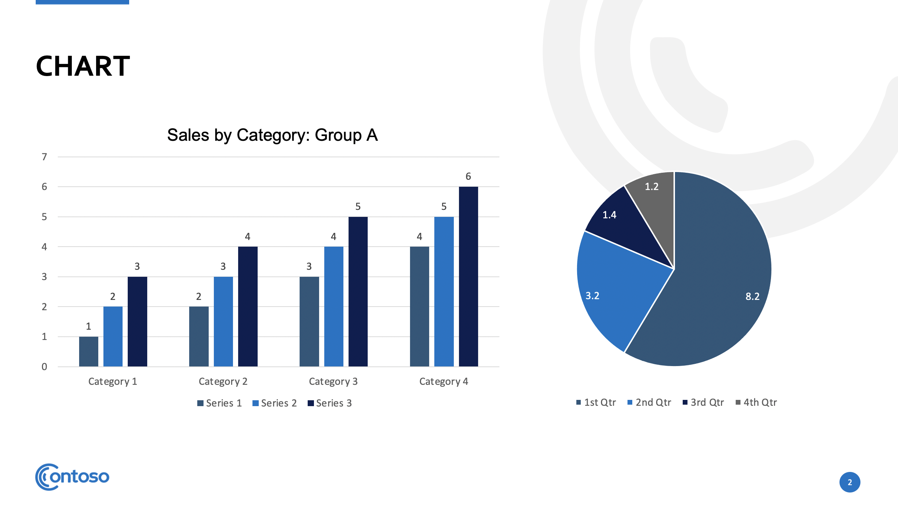
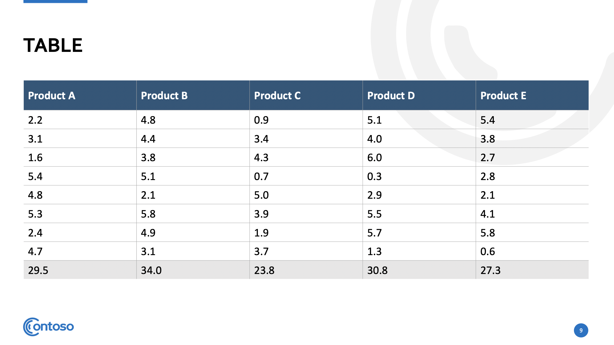
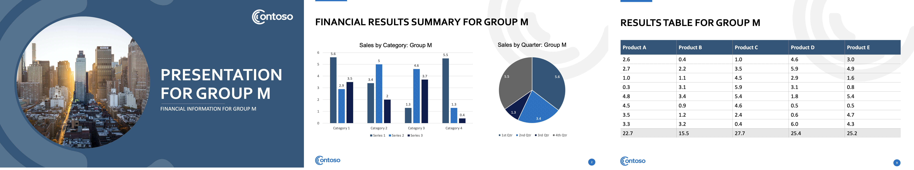

```{r setup, include=FALSE}
knitr::opts_chunk$set(echo = TRUE)
```

## Purpose of this tutorial

This tutorial serves a number of purposes.  First, it helps with an important real world use case in that many data scientists in business reporting settings are asked to pipe their data into Powerpoint presentations (whether they like it or not!).  Most commonly these are numerous parameterized presentations where the format, charts and content are the same but the data changes - for example by organization unit.  Frequently there can be a need to generate tens, hundreds or even thousands of such reports from a specified example template.  This gives an example of how to code up and automate such a workflow.

Second, this tutorial serves as an interesting example of how R users can take advantage of useful Python functionality through importing it into R via the `reticulate package`. It also shows how new developments in `dplyr` allow us to use the tidyverse as a foundation for a diverse range of workflows - in this case the generation of parameterized Powerpoint documents.

## Context and prerequisites    

This tutorial deals with the following scenario:

*  The user base needs results delivered in the form of editable Powerpoint documents containing charts and tables.
*  A example document exists that is fully populated with dummy data or example data.
*  The same document needs to be recreated with different data for different groups, and saved with different filenames for distribution around the organization.  This workflow facilitates the creation of an arbitrarily large number of such parameterized documents.

This workflow is completely executable using open source technology.  For execution in Python, a conda environment or virtual environment based on Python 3.7 is recommended with the `pandas` and `python-pptx` packages installed.  For importing into R, the `reticulate` package will be needed.

There are three parts to this tutorial:

1.  How to use the `python-pptx` package to write a function to replace data in an existing Powerpoint presentation.
2.  How to use this in Python to batch produce an arbitrarily large number of parameterized Powerpoint documents.
3.  How to import the function into R and use the tidyverse to batch produce an arbitrarily large number of parameterized Powerpoint documents.

## Getting started

Let's imagine we work for an organization that consists of 20 sales groups named consecutively from Group A to Group T.  An existing Powerpoint document called `ppt-template.pptx` exists in the `templates` folder of this repo with dummy data that contains the following:

* A title page, which we will want to customize to the specific sales group name.
* A page with two charts - a bar chart and a pie chart.  We will want to replace the data and re-title these two charts to refer to the specific sales group.
* A page with a table of sales data.  We will want to replace the data in this table with the data for the specific sales group.

```{r, fig.align="center", echo = FALSE, fig.cap= "The slides we need to edit"}

```

The data we need to replace into this document can be found in the `data` folder.  This is randomly generated data for the purposes of this demonstration. The file `chart_df.csv` contains the data for the bar and pie charts and the various files prefixed `table_` contain the data for each sales group that is intended to go into the table on the last slide. 


## Using the `python-pptx` package to replace elements of Powerpoint presentations

We start in Python by importing some functions we need from the `python-pptx` package.  In this example we only need a couple of simple functions, but I encourage you to explore the wide range of functions available in this package to edit and customize Powerpoint elements.

```{python}
from pptx import Presentation
from pptx.chart.data import CategoryChartData
```

Next we load in our existing dummy presentation into our Python session:

```{python}
pres = Presentation("templates/ppt-template.pptx")
```

By examining `pres` we can see that it is a Powerpoint presentation object.  
```{python}
pres
```

`pres` is actually a complex nested XML object.  But as you'd expect, it contains some slides.  We can create a list of slides and check that that list contains three slides as we would expect.

```{python}
slides = [slide for slide in pres.slides]
len(slides)
```

Looks good.  Now each slide contains some shapes, which can be anything from text boxes to charts, tables or diagrams.  

### Editing text boxes in shapes

Let's see how many shapes are on the title slide:

```{python}
slide0 = slides[0]
slide0_shapes = [shape for shape in slide0.shapes]
len(slide0_shapes)
```

So there are three shapes on the title slide.  We know one of these is the title placeholder text box and the other is a subtitle placeholder text box, and we can identify and grab them both because they both contain a `text_frame` (the XML term for a text box).  

```{python}
title_shapes = [shape for shape in slide0.shapes if shape.has_text_frame]
len(title_shapes)
```

Now, because these are placeholder objects, the placeholder text may not match what is visible in the template due to template formatting, so we will need to see what the placeholder text is for each:

```{python}
placeholder_text = [shape.text for shape in title_shapes if shape.has_text_frame]
placeholder_text
```

We can now use this information to replace the text in these text boxes.  Let's do this with the title text for the Group A presentation just to check it works:

```{python}
title = [shape for shape in title_shapes if shape.has_text_frame and shape.text == 'Presentation title Alt']
title[0]. text = "Presentation for Group A"
```

We can check that this worked:

```{python}
new_placeholder_text = [shape.text for shape in title_shapes if shape.has_text_frame]
new_placeholder_text
```

That worked!  We can use a similar method to edit the subtitle.

### Loading new data into charts

We can identify chart objects using the `has_chart` property of shapes.  Let's check that there are two charts on the second slide:

```{python}
slide1 = slides[1]
slide1_charts = [shape for shape in slide1.shapes if shape.has_chart]
len(slide1_charts)
```

We can't be totally sure that these charts are listed in the order they appear on the slide, but we can identify a specific chart by its title, which is nested inside a title text frame in the chart object.

```{python}
bar_chart = [shape.chart for shape in slide1_charts if shape.chart.chart_title.text_frame.text == 'Statistics here']
```

Now that we have our bar chart, we need to rewrite its data.  We note that the bar chart has three series of bars, each representing one of four categories.  When we rewrite data in this chart, we need to rewrite it all - it is not possible to only rewrite part of it.  Therefore we define the categories from scratch and write in three series of data into a `CategoryChartData` object.  Here I will use some random example data to illustrate.  

```{python}
chart_data  = CategoryChartData()
chart_data.categories = ['Category ' + str(i) for i in range(1,5)]
chart_data.add_series('Series 1', range(1, 5))
chart_data.add_series('Series 2', range(2, 6))
chart_data.add_series('Series 3', range(3, 7))
```

And we now replace the data in our bar chart with this data, and give it a new title.

```{python}
bar_chart[0].replace_data(chart_data)
bar_chart[0].chart_title.text_frame.text = "Sales by Category: Group A"
```

At this point we can save our presentation and view one of the pages to see if this worked.

```{python}
pres.save("test1.pptx")
```

We can see by examining the second slide that our bar chart has been successfully updated with the new data.

```{r, fig.align="center", echo = FALSE, fig.cap= "The bar chart was successfully updated"}

```

Using similar methods, we are able to update the pie chart and the title of this slide also.

### Editing tables

Let's get our table from the last slide using similar methods to how we obtained our charts and text boxes.  We expect only one table.

```{python}
slide2 = pres.slides[2]
table = [shape for shape in slide2.shapes if shape.has_table]
len(table)
```

Great!  Now tables need to be edited cell by cell, which sounds painful, but actually is pretty easy using indexing.  We note that there is a row of column names, then eight rows of data, then a row for totals.  Let's bring in a table from our data sets.

```{python}
import pandas as pd
table_A = pd.read_csv("data/table_A.csv")
table_A
```

Now the first row of our table is a set of column names, so we can edit the text to match the column names in our `table_A` dataframe:

```{python}
for j in range(0,5):
    table[0].table.cell(0, j).text = "Product " + table_A.columns.values[j]
```

Then we can update the values in each cell directly from the dataframe:

```{python}
for i in range(1,9):
    for j in range(0,5):
      table[0].table.cell(i,j).text = str(table_A.iloc[i-1, j])
```

Finally we put some totals in the last row (ensuring we format to avoid any of Python's floating point behavior):

```{python}
for j in range(0,5):
    table[0].table.cell(9,j).text = "{:.1f}".format(sum(table_A.iloc[:,j]))
```

Let's save again and check that the table did update with this new data:

```{python}
pres.save("test2.pptx")
```

Upon examination, it looks like we were successful in updating the table:

```{r, fig.align="center", echo = FALSE, fig.cap= "The table was successfully updated"}

```

### Creating a function to update the presentation

Now that we have learned the basics of editing this presentation, we can make this all reproducible by writing a Python function that expects five inputs as follows:

* `group`:  The group parameter for the document.
* `data_chart`:  The dataframe containing the various chart statistics for the charts
* `data_table`:  The dataframe used to replace the table
* `input file`:  The path to the file to be edited
* `output_file`: The path where the new file will be written

You can see this function in the `edit_pres.py` file in this repo.  Let's source this function and test it by generating a document for sales group M.

```{python}
# load data
chart_df = pd.read_csv("data/chart_df.csv")
table_M = pd.read_csv("data/table_M.csv")

# load function
exec(open('edit_pres.py').read())

# write Group M presentation
edit_pres("M", chart_df, table_M, "templates/ppt-template.pptx", "test3.pptx")
```

We can examine to see the results:

```{r, fig.align="center", echo = FALSE, fig.cap= "All slides have been successfully updated"}

```

Great! We now have everything we need to start batch producing parameterized Powerpoint.

## Batch producing in Python

Now that we have set up our Python function, we just need to load it into our session along with all the data we will use to update it into the twenty version for each sales group.

```{python}
import glob
import os

# load function
exec(open('edit_pres.py').read())

# load all dataframes in data folder into a dict
path = "data/"
data_files = glob.glob(os.path.join(path, "*.csv"))
dataframes = dict()
for i in data_files:
    path = os.path.basename(i)
    name = path.split('.')[0]
    dataframes[name] = pd.read_csv("data/" + name + ".csv")
```

Now lets run our function for each group and write the output Powerpoint as an appropriately named file inside an `outputs` directory.

```{python}
# create outputs directory if it doesn't exist
if not os.path.isdir("outputs"):
  os.mkdir("outputs")

# generate a ppt for each group
for group in dataframes['chart_df'].group.values:
  tables_data = dataframes['table_' + group]
  edit_pres(group, dataframes['chart_df'], tables_data, 
  'templates/ppt-template.pptx', 'outputs/results_group_' + group + '.pptx')
```

It looks like it worked!  I've put these outputs in the `outputs_example` folder in this repo.

## Importing this into R and using the Tidyverse for a neat update workflow

### Pointing to your Python environment 

To use our great python function `edit_pres.py` inside R, R will need to know where to find the Python environment containing the installed packages it uses.  The easiest way to do this is to create a file called `.Rprofile` inside your R project and use it to set the `RETICULATE_PYTHON` environment variable.  This will need to be set to the path to the *Python executable* inside your Python environment where this function was written.  Here is an example of the line in my `.Rprofile` which does this:

```
Sys.setenv(RETICULATE_PYTHON="/home/rstudio/.local/share/r-miniconda/envs/pptx/bin/python3")
```

For this new variable to take effect, you will need to restart R. Once R is restarted, any Python code in your project will now be executed by the Python executable defined by `RETICULATE_PYTHON`.  

### Loading Python function

With our Python environment set, we can use the `reticulate` package to load our Python function into R.  In doing so, it instantly becomes an R function that works with R inputs.

```{r}
library(reticulate)

source_python("edit_pres.py")

edit_pres
```

We can load in all our data as dataframes and test the function to see if it works:

```{r}
# load in data files
for (file in list.files("data")) {
  splits <- strsplit(file, "\\.")
  assign(splits[[1]][1],
         read.csv(paste0("data/", file)))
} 

# test edit_pres function on Group M
edit_pres("M", chart_df, table_M, "templates/ppt-template.pptx", "test4.pptx")
```

### Using `dplyr` to do this all in a neat table

Our `chart_df` object is a regular dataframe where each row represents the chart data for each sales group.  However our table data is all stored in different dataframes.  We can add a *list column* to capture all the different table datasets neatly aligned with our chart data by using a mutate on the `group` column:

```{r, warning = FALSE, message = FALSE}
library(dplyr)

full_data <- chart_df %>% 
  dplyr::rowwise() %>% 
  dplyr::mutate(
    table = list(get(paste0("table_", group)))
  )
```
If we examine a few columns, we can see our tables stored in the rows of the `full_data` dataframe.

```{r}
full_data %>% 
  dplyr::select(group, starts_with("pie"), table)

```
And now for the final magic step.  We can do a further mutate to run our Python function across the rows of this dataframe to write all our Powerpoint documents:

```{r}
# create outputs directory if it doesn't exist
if (!dir.exists("outputs")) {
  dir.create("outputs")
}

# rowwise mutate to run function for all groups
write_pptx <- full_data %>% 
  dplyr::rowwise() %>% 
  dplyr::mutate(
    pptx = edit_pres(group, ., table, 
                     "templates/ppt-template.pptx", 
                     paste0("outputs/results_group_", group, ".pptx" ))
  )
```

This new dataframe will contain a new column containing confirmation of the written files, and you can look in the `outputs` folder to find and examine them.

```{r}
write_pptx %>% 
  dplyr::select(group, starts_with("pie"), table, pptx)
```

## Extending this work

You can extend this work to create quite a powerful reporting infrastructure as follows:

* Use a database connection to query the data needed for the Powerpoint documents
* Use a web front end (for example in Shiny or Django) to generate the Powerpoint on demand through querying back-end databases, writing to a template and serving up the new file as a download.


